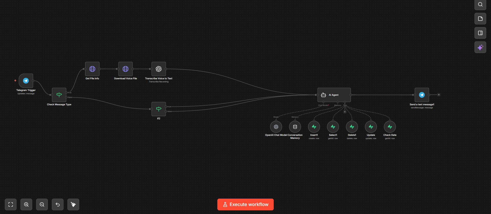

# 🏨 Carmelo: AI-Powered Hotel Reservation Agent

**THIS FILES ARE MEANT FOR PERSONAL USE. DO NOT DISCLOSE THIS FILES AS YOURS**

**Revolutionizing Hospitality with n8n and LLM Integration**

Carmelo is an advanced AI agent designed to streamline hotel booking management. Developed to reduce the administrative burden on reception staff, Carmelo autonomously handles guest inquiries, checks real-time availability, and manages database reservations 24/7 with a friendly, professional tone.

---

## 🏆 Awards
* **Finalist at "Premio Salvatore Di Bartolo"** – Recognized for innovation in local business automation.

---

## 🚀 Key Features
* **Automated Booking Engine:** Natural language processing to collect check-in/out dates, guest details, and preferences.
* **Real-time Database Sync:** Direct integration with PostgreSQL to verify room availability and prevent overbooking.
* **Smart Authentication:** Securely handles reservation modifications and cancellations by verifying guest identity.
* **Multimodal Support:** Capable of processing both text and voice messages (STT) for a seamless user experience.
* **Automated Room Management:** Automatically toggles room availability status upon booking or cancellation.

---

## 🛠️ Tech Stack
* **Orchestration:** [n8n](https://n8n.io/) (Workflow Automation)
* **AI Engine:** OpenAI GPT-4o / LangChain
* **Database:** [PostgreSQL](https://www.postgresql.org/) (via Supabase)
* **Interface:** Telegram Bot API
* **Speech-to-Text:** OpenAI Whisper (for voice message processing)

---

## 🧠 System Architecture
The agent operates through three core logic modules:
1. **Understanding Module:** Uses NLP to extract entities (dates, room types, guest info) from unstructured user input.
2. **Logic & Validation:** n8n cross-checks requested dates against the PostgreSQL database and validates Italian Tax Codes (Codice Fiscale) and contact info.
3. **Action Module:** Executes SQL commands to `INSERT`, `UPDATE`, or `DELETE` reservations and sends instant confirmation to the guest.

   

---

## 👥 The Team
Developed by:
* **Fabrizio Petralia** – Lead Developer / Backend & AI Logic
* **Martina Lo Giudice** – UI/UX & Documentation
* **Manuel Di Pino** – Database Design & Testing

---

## 📁 Repository Structure
* `workflows/`: Cleaned n8n `.json` export (ready for import).
* `database/`: SQL schema for `Clients`, `Rooms`, and `Reservations`.
* `assets/`: Workflow diagrams and UI screenshots.

---

> **Note:** This project was developed as part of a technical competition to demonstrate the power of low-code automation combined with modern LLMs.
---

